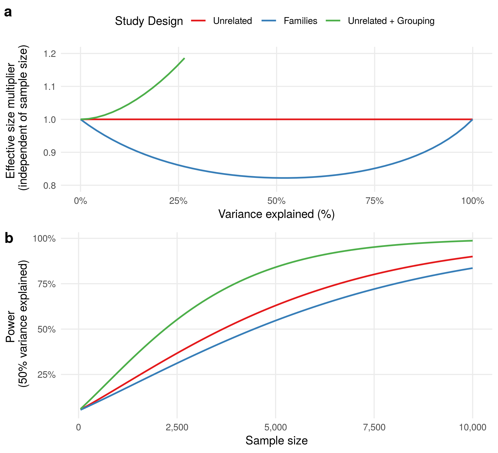

# Preface {-}

Links

- Public version of the book:
  [html](https://hemostat.github.io/Public/Papers/05-int-rel/bookdown/index.html),
  [pdf](https://hemostat.github.io/Public/Papers/05-int-rel/bookdown/gxefam.pdf),
  [docx](https://hemostat.github.io/Public/Papers/05-int-rel/bookdown/gxefam.docx),
  [md](https://hemostat.github.io/Public/Papers/05-int-rel/bookdown/gxefam.md),
  [tex](https://hemostat.github.io/Public/Papers/05-int-rel/bookdown/gxefam.tex)
  

<!--chapter:end:index.Rmd-->

# Manuscript

**Title**: Statistical power in GWAS revisited: effective sample size, genetic relatedness, and gene-by-environment interactions

**Title 2**: Advantages and limitations of linear mixed model in genetic association studies

**Abstract**:
Genome-wide association studies (GWAS) have identified 
thousands of genetic variants associated with complex diseases and 
heavily rely on increasing the sample size. 
Recent analyses of biobank-scale genetic data suggest: 
(i) inclusion of genetically related individuals empowers GWAS [@loh2018mixed]; 
(ii) the wealth of collected environmental exposures has potential 
to uncover gene-by-environmental interactions [@young2016multiple]. 
However, quantification of GWAS power --- 
the non-centrality parameter ($NCP$) of association test,
which is proportional to the sample size ($n$) and the variance explained by genetic variant ($q^2$) --- 
holds only for unrelated individuals. 
Here, we first expanded it by incorporating individual relationships by linear mixed model. 
We next studied gene-by-environment interactions, 
where interaction effect on trait is tested in the presence of marginal genetic effect.
<!-- results/conclusions -->
In result, the derived formulas have a range of implications. 
For testing marginal genetic effect, one can quickly assess the power in studies involving related individuals. Because of the potential gain in power for testing gene-by-environment interaction, the formula for interactions will allow optimization of the study design of related individuals.

## Introduction {#introduction}

The vast majority of genome-wide association studies (GWAS) conducted so far 
has used standard fixed effect models. 
This strategy has been showed to be at the same time robust and fast, 
allowing for the analysis of thousands of individuals and 
millions of genetic variants in a reasonable computation time. 
However, in parallel, there has been increased interest in using linear mixed model (LMM) 
for the purpose of genome-wide association mapping. 
LMM has been considered for several reasons. 
Random effects models have primarily been used to control for the type I error rate account 
when analyzing related individuals. 
Indeed, when not modeled, genetic relationship will in general lead to an underestimation of the effect estimates, 
thus producing inflated statistics. 
LMM has also been showed to be of interest for increasing power, 
and because of that, there has been increasing literature 
about the possibility of using LMM more systematically in GWAS [ref]. 
However, LMM have also limitation, including in particular a dramatic increase in computation time, 
making the approach intractable for extremely large sample size, 
or when analyzing multiple phenotypes [ref]. ... other issues .... 
Overall, many issues have been solved, 
and LMM will likely be increasingly used in GWAS settings by the community. 
However, the expected gain in power that one might achieve 
relative to the computational cost of LMM has not been solved. 

Here, we proposed an analytical framework 

Previous studies already discussed the ability of LMM to prevent false positive associations due to population stratification, 
how to reduce the computational burden of LMM [ref],
and potential gain in power that might be achieved 

However the later 

How the 2 combine both... 

## Methods and Analytical Derivations

### Linear mixed model for genetic association study
We consider the following linear mixed model
to study the impact of relatedness among individuals on modeling a continuous phenotype $y$. 

\begin{equation}
  y = X \beta + \sum_{k=1}^{m}{r_k} + e
(\#eq:assoclmm)
\end{equation}

where $n$ is the number of individuals, 
$p$ is the number of covariates or fixed effects,
$m$ is the number of structured random effects apart from the residuals errors, 
$y$ is a phenotype vector of length $n$,
$X$ is a matrix of covariates of size $n \times p$,
$\beta$ is a vector of fixed effects of length $p$.
The vectors of random effects $r_k$ and $e$ 
are mutually uncorrelated and
multivariate normally distributed
as  $\mathcal{N}(0, \sigma^2_k R_k)$ and $\mathcal{N}(0, \sigma^2_r I)$.
The variance-covariance matrices are parametrized with scalar parameters (referred as variance components) 
and constant matrices of size $n \times n$ 
that express relationships among $n$ individuals.
The first $m$ random effects $r_k$ are referred here as structured,
whereas the last component $e$ is simply the residual errors 
which are independent and identically distributed.

Thus, the phenotype follows a multivariate normal distribution (MVN)
and Equation \@ref(eq:assoclmm) can be rewritten:

\begin{equation}
  y \sim \mathcal{N} (X \beta, V) = \mathcal{N} (X \beta, \sum_{k=1}^{m}{\sigma_k^2 R_k} + \sigma_r^2 I) 
(\#eq:assocmvn)
\end{equation}

An assosiation test for a given variable in the matrix $X$
consists in constructing the score test statistic based on the estimates of
effect size and its variance, $Z = \hat{\beta}_x / \sqrt{var(\hat{\beta}_x)}$.
The score follows the standard normal distribution $Z \sim \mathcal{N}(0, 1)$,
and the $\chi^2$ test  with non-centrality parameter 
$NCP = \beta^2_x / var(\hat{\beta}_x)$ 
quantifies the statistical power for a given true effect size $\beta_x$. 

We further consider several parameterizations of the model in Equation \@ref(eq:assocmvn) 
that depend on (i) whether marginal genetic or gene-environment interaction effect is under testing;
(ii) whether structured random effects are included or only the residual errors are present.
The detailed derivation of the formulas presented next is given in 
Supplementary Material, Section \@ref(derivations).

We introduce common assumptions and notations before going further.
We assume that all vectors of the phenotype ($y$) and 
covariates (columns in the matrix $X$) are centered.
The phenotype vector is additionally standardized ($var(y) = 1$).
The genotype vector $x_g$ is considered as a realization of 
a vector of random variables $\mathcal{X_g}$, 
which is a genotype in $n$ individuals with a minor allele frequency $p$.
We denote the distribution 
$\mathcal{X_g} \sim (\mu_g, \Sigma_g) = (p 1_n, \delta_g^2 K) = (p 1_n, 2 p (1-p) K)$,
where $K$ is the kinship matrix of size $n \times n$ 
(it can be the identity matrix $I$ for genetically unrelated individuals)
and $1_n$ is a vector of $n$ ones.

### Testing marginal genetic effect 

The genetic effect on phenotype in unrelated individuals is 
evaluated under the standard linear model $y \sim \mathcal{N} (\mu x_0 + \beta_g x_g, \sigma_r^2 I)$,
where $x_0 = 1_n$ is a vector of $n$ ones, 
$\mu$ is a mean of the phenotypic values, 
$x_g$ is a vector of length of the genotypic values,
$\beta_g$ is the effect size of the genotype.
The NCP parameter of the test in linear model is well known to be proportional to the sample size and the variance captured by the genotype (see also Section \@ref(lmg)).

\begin{equation}
NCP_{unrel} \approx \beta_g^2 \delta_g^2 n  = \hat{\beta}_g^2 2 p (1 - p) n
(\#eq:ncpgun)
\end{equation}

When the individuals are genetically related and/or 
the covariance of the phenotype is modeled using structured relationship matrices among individuals,
the following linear mixed model is stated, $y \sim \mathcal{N} (\mu x_0 + \beta_g x_g, \sum_{k=1}^{m}{\sigma_k^2 R_k} + \sigma_r^2 I)$. 
The initial step in solving a linear mixed model is to estimate random effects parameters
($\sigma_k^2$ and $\sigma_r^2$) 
by restricted maximum likelihood (REML) or other optimization technique [@Lynch1998]. 
Once the estimate of the variance-covariance matrix is found, 
$\hat{V} = \sum{\hat{\sigma}_i^2 R_i} + \hat{\sigma}_r^2 I$,
the generalized least squares (GLS) for fixed effects are applied in the following matrix form, 
$\hat{\beta} = \left(X^T \hat{V}^{-1} X\right)^{-1} X \hat{V}^{-1} y$.

In Section \@ref(lmmg) we derived the estimate of $\beta_g$ and its variance,
$\hat{\beta}_g  = \left(\tilde{x}_g^T \hat{V}^{-1} \tilde{x}_g\right)^{-1} \tilde{x}_g^T \hat{V}^{-1} \tilde{y}$
and $var(\hat{\beta_g}) = 1 / (\tilde{x}_g^T \hat{V}^{-1} \tilde{x}_g)$, respectively.
We further approximated the term $\tilde{x}_g^T \hat{V}^{-1} \tilde{x}_g$
using the expected mean of a quadratic form 
of the random variable $\mathcal{\tilde{X}_g}$ and the transformation matrix $\hat{V}^{-1}$
(see Equation \@ref(eq:quadform1)).
The NCP parameter of the test in linear mixed model has the following form,
where $tr$ denote the trace operator.

\begin{equation}
NCP_{rel} \approx beta_g^2 tr(\hat{V}^{-1} \Sigma_g) = \beta_g^2 \delta_g^2 tr(\hat{V}^{-1} K) = \beta_g^2 2 p (1 - p) tr(\hat{V}^{-1} K)
(\#eq:ncpgrel)
\end{equation}

The effective size multiplier, defined as $NCP_{rel} / NCP_{unrel}$, 
gives a quantitative assessment of gain or loss in power 
when comparing the study design of related and unrelated individuals.

\begin{equation}
NCP_{rel} / NCP_{unrel} = tr(\hat{V}^{-1} K) / n
(\#eq:ncpg)
\end{equation}

We further expand Equation \@ref(eq:ncpgrel) for two specific cases of 
(i) related individuals in families; 
(ii) unrelated individuals under the the infinite-testimal model.
We also make use of the connection between 
the trace operator and eigen-value decomposition 
(Section \@ref(propositions)).

For individuals in families and 
the model $y \sim \mathcal{N} (\mu x_0 + \beta_g x_g, \sigma_k^2 K + \sigma_r^2 I)$,
we have an updated formula of $NCP_{ref}$.

\begin{equation}
\begin{split}
NCP_{fam} & = \beta_g^2 2 p (1 - p) tr \left( \left(\hat{\sigma}_k^2 K + \hat{\sigma}_r^2 I\right)^{-1} K \right)  \\
 & = \beta_g^2 2 p (1 - p) tr \left( \left(\hat{\sigma}_k^2 I + \hat{\sigma}_r^2 K^{-1}\right)^{-1} \right) \\
 & = \beta_g^2 2 p (1 - p) \sum_{i=1}^{n}{\left(\hat{\sigma}_k^2 + \hat{\sigma}_r^2 \left(\lambda_{K}^i\right)^{-1}\right)^{-1}}
\end{split}
(\#eq:ncpgfam)
\end{equation}

When modeling the polygenic effect in unrelated individuals
using the genetic relationship matrix (GRM) (denoted as $M$ in equations) 
$y \sim \mathcal{N} (\mu x_0 + \beta_g x_g, \sigma_m^2 M + \sigma_r^2 I)$,
we rewrite $NCP_{ref}$ as following.

\begin{equation}
\begin{split}
NCP_{unrel+grm} & = \beta_g^2 2 p (1 - p) tr( (\hat{\sigma}_k^2 M + \hat{\sigma}_r^2 I)^{-1} )  \\
 & = \beta_g^2 2 p (1 - p) \sum_{i=1}^{n}{(\hat{\sigma}_m^2 \lambda_{M}^i + \hat{\sigma}_r^2)^{-1}}
\end{split}
(\#eq:ncpggrm)
\end{equation}

### Testing gene-environment interaction effect 

The gene-environment interaction effect on phenotype in unrelated individuals is 
evaluated under the standard linear model $y \sim \mathcal{N} (\mu x_0 + \beta_g x_g + \beta_e x_e + \beta_{ge} x_{ge}, \sigma_r^2 I)$,
where $x_0 = 1_n$ is a vector of $n$ ones, 
$\mu$ is a mean of the phenotypic values, 
$x_g$ is a vector of length of the genotypic values,
$\beta_g$ is the effect size of the genotype,
$x_e$ is a environment exposure vector of length $n$,
$\beta_e$ is the effect size of the environment exposure,
$x_{ge}$ is a vector of length $n$ of gene-environment interaction,
$\beta_{ge}$ is the interaction effect size.

The coding scheme of the genotypic and environmental variables 
to study gene-environment interaction 
under linear model is important and has been reviewed elsewhere [@Aschard2016]. 
Here, we work with centered variables $\tilde{x}_g$ and $\tilde{x}_e$
and define the interaction variable $\tilde{x}_{ge}$ 
by (i) element-wise multiplication of the two variables, 
(ii) centering the resulted product.
Once the covariates are centered as described above,
the effect sizes and their standard errors can be estimated independently from other covariates
if we assume that 
the two random variables of genotype and environmental exposure 
are generated independently [@Aschard2016, Appendix C].
We also note that different coding schemes give different estimates of effect sizes, 
but the test statistic for gene-environment interaction ($NCP$) 
is the same [@Aschard2016, Appendix B].

We first need to define two matrices $E$ and $D$.
The matrix $E$ is related to the environment exposure (centered) vector $\tilde{x}_e$:
$E$ is the diagonal matrix with values equal to those observed in $\tilde{x}_e$, 
i.e. $diag(E) = \tilde{x}_e$.
We also introduce a matrix $D$, 
which value at row $i$ and column $j$ is equal to the product 
of two diagonal entries $i$ and $j$ of $E$,
i.e. $D_{i,j} = E_{i,i} E_{j,j}$.
When the environmental exposure is binary and the observed frequency of exposure is $f$,
then we denote the matrices as $E_b$ and $D_b$.
Then the values on diagonal of the matrix $E_b$ are either $-f$ or $1 - f$,
while values of the matrix $D_b$ are either $f^2$, $(1 - f)^2$ or $f (1 - f)$.

Then the NCP parameter of the test in linear model has the following form (see Section \@ref(lmmge)).

\begin{equation}
NCP_{unrel}^i \approx \beta_{ge}^2 \delta_g^2 tr(E_b^2) = \beta_{ge}^2 2 p (1 - p) f (1 - f) n 
(\#eq:ncpgeun)
\end{equation}

When the individuals are genetically related and/or relationships among individuals are modeled,
we again use the linear mixed model 
$y \sim \mathcal{N} (\mu x_0 + \beta_g x_g + \beta_e x_e + \beta_{ge} x_{ge}, \sum_{k=1}^{m}{\sigma_k^2 R_k} + \sigma_r^2 I)$.

In Section \@ref(lmmge) we derived the estimate of $\beta_{ge}$ and its variance for linear mixed model,
$\hat{\beta}_{ge}  = \left(\tilde{x}_{ge}^T \hat{V}^{-1} \tilde{x}_{ge}\right)^{-1} \tilde{x}_{ge}^T \hat{V}^{-1} \tilde{y}$
and $var(\hat{\beta_{ge}}) = 1 / (\tilde{x}_{ge}^T \hat{V}^{-1} \tilde{x}_{ge})$, respectively.
As $\tilde{x}_{ge}$ is a realization of 
a random variable $\mathcal{\tilde{X}}_{ge} = E \mathcal{\tilde{X}}_{g}$,
we showed that $var(\mathcal{\tilde{X}}_{ge}) = \delta_g^2 D \circ K$.

Here, we introduce a special kinship matrix $K_{D}$
"masked" by the (observed) environmental exposure though the matrix $D$
(the operator $\circ$ denotes the Hadamard product, i.e. the element-wise multiplication).

\begin{equation}
\begin{split}
K_{D} =  D \circ K
\end{split}
(\#eq:kdmat)
\end{equation}

In Section \@ref(lmmge) we further approximated the term 
$\tilde{x}_{ge}^T \hat{V}^{-1} \tilde{x}_{ge}$ 
by applying  the expression for the mean of a quadratic form 
of the random variable $\mathcal{\tilde{X}_{ge}}$ and the transformation matrix $\hat{V}^{-1}$
(see Equation \@ref(eq:quadform1)).
The NCP parameter of the test in linear mixed model has the following form.

\begin{equation}
NCP_{rel}^i \approx \beta_{ge}^2 \delta_g^2 tr(\hat{V}^{-1} K_{D}) = \beta_{ge}^2 2 p (1 - p) tr(\hat{V}^{-1} K_{D})
(\#eq:ncpgerel)
\end{equation}

The $K_{D}$ matrix is equal to the $E^2$ matrix
in the case of genetically unrelated individuals ($K = I$),
and the two formulas \@ref(eq:ncpgerel) and \@ref(eq:ncpgeun) become the same.
We also note that the variance of the environmental exposure 
is contained within the matrices $K_{D}$ and $E^2$,
although it is possible to similarly define the scaled matrices.

TODO: $V = \sigma^2_k K + \sigma^2_i K^i + \sigma^2_r I$ [@Sul2016]

## Results

### Analytical results for testing marginal genetic effect

| Study design | $V = Var(y)$ | $\Sigma_g = Var(\mathcal{\tilde{X}}_g)$  | $NCP$ |
|-------------------|-------------|--------------|----------------------------------|
| Unrelated | $\sigma_r^2 I$ | $\delta_g^2  I$ |  $\beta^2_g (\tilde{x_g}^T \tilde{x_g}) \approx \beta^2_g \delta_g^2 n$ |
| Families | $\sigma_k^2 K + \sigma_r^2 I$ | $\delta_g^2  K$ | $\beta^2_g (\tilde{x_g}^T \hat{V}^{-1} \tilde{x_g}) \approx \beta^2_g \delta_g^2 \mbox { } tr(\hat{V}^{-1} K)$ | 
| Unrelated + Grouping | $\sigma_h^2 H + \sigma_r^2 I$ | $\delta_g^2  I$ | $\beta^2_g (\tilde{x_g}^T \hat{V}^{-1} \tilde{x_g}) \approx \beta^2_g \delta_g^2 \mbox { } tr(\hat{V}^{-1})$ |

Table: (\#tab:assoc-gen) Analytical comparison of study designs to detect marginal genetic association.
Study designs differ in individual relationships that informs modeling of outcome ($y$) and distribution of genotype under association test ($x_g$). Study designs under comparison include: unrelated individuals; related individuals in families; unrelated individuals with a grouping factor such as house-hold (not related to a variable under test). Notation: $\tilde{x_g}$, mean-centered genotype vector $x_g$; $\delta_g^2 = 2 p (1 - p)$, the variance of genotype random variable with the minor allele frequency $p$; $K$, the additive kinship matrix for family-based study design; $NCP$, the non-centrality parameter of the test; $\hat{V}$, the estimated variance-covariance matrix of $y$.

(ref:power-marginal) Three study designs are compared in terms of power to detect marginal genetic effect under the model $y \sim \mathcal{N}(\mu + \beta_g x_g, V)$ (see also Table \@ref(tab:assoc-gen)). The reference study design "Unrelated" with $V = \sigma^2_r I$ is; the study

Two study designs with a structured variance components, unrelated individuals with a non-genetic grouping factor and related individuals in families, are compared to the reference study design of unrelated individuals. The performance is evaluated to  To make the study designs comparable, the sum of variance components in the $V$ matrix is equal to one. (a) The effective size multiplier, estimated as $tr(V^{-1} \Sigma_g) / n$, depends on the variance explained. (b) When the variance explained fixed to 50% and the sample size varies,  Notation: $n$, the sample size.

Ref \@ref(fig:power-marginal)

### Analytical results for testing gene-environment interaction effect

| Study design | $V = Var(y)$ | $\Sigma_{ge} = Var(E \mathcal{\tilde{X}}_g)$  | $NCP$ |
|------------|-------------|--------------|----------------------------------|
| Unrelated | $\sigma_r^2 I$ | $\delta_g^2  E^2$ |  $\beta^2_{ge} (\tilde{x_{ge}}^T \tilde{x_{ge}}) \approx \beta^2_{ge} \delta_g^2 tr(E^2)$ |
| Unrelated (binary) | $\sigma_r^2 I$ | $\delta_g^2  E_b^2$ |  $\beta^2_{ge} (\tilde{x_{ge}}^T \tilde{x_{ge}}) \approx \beta^2_{ge} \delta_g^2 f (1 -f) n$ |
| Families | $\sigma_k^2 K + \sigma_i^2 K_i + \sigma_r^2 I$ | $\delta_g^2  K_D$ | $\beta^2_{ge} (\tilde{x_{ge}}^T \hat{V}^{-1} \tilde{x_{ge}}) \approx \beta^2_{ge} \delta_g^2 \mbox { } tr(\hat{V}^{-1} K_D)$ | 

Table: (\#tab:assoc-ge) Analytical comparison of study designs to detect gene-environment interaction association.

(ref:power-interaction) Comparison of study designs to detect gene-environment interaction effect. The binary exposure is generated such a way that siblings are exposed, while parents don't (the frequency of exposure $f = 3/5 = 0.6$).

Ref \@ref(fig:power-interaction)

### Implication in association studies

#### Effective sample size in post-GWAS analyses

Many post-GWAS analyses, such as LDSC regresssion or meta-analysis, 
rely on the sample size as an input parameter under assumption
that summary statistics come from a set of unrelated individuals under association linear model.
Though, tools that employ linear mixed models, for example, BOLT-LMM,
achieve the effective sample size ($n_{eff}$) larger than the true sample size ($n$) [@loh2018mixed].

Gazal _et al._ showed that the LDSC regression overestimates per-variant heritability 
when using summary statistics from BOLT-LMM and the true sample size ($n$) [@Gazal2017].
The authors proposed an empirical solution to estimate the scaling factor or the effective size multiplier:
taking ratios of chi-squared statistics computed by BOLT-LMM _vs._ linear regression 
at genome-wide significant variants [@loh2018mixed].
In our work, we derived an analytical form for the effective size multiplier
in Equations \@ref(eq:ncpg) and \@ref(eq:ncpggrm).

#### Optimization of study design

In genetic association and linkage studies performed in related individuals grouped in families,
selection of a family-based design that achieves the most statistical power has been extensively studied [ref].
For example, the multipoint linkage analysis was shown to have greater power
in extended pedigrees than in smaller pedigrees such as sibships [@Almasy1998].

<!--chapter:end:ch-manu.Rmd-->

# Supplementary Material

## Propositions {#propositions}

**Quadratic form**: If $\mathcal{X}$ is a vector of random variables
with mean $\mu$ and (nonsingular) covariance matrix $\Sigma$, 
then the quadratic form $\mathcal{X}^T A \mathcal{X}$ is a scalar random variable:

\begin{equation}
E(\mathcal{X}^T A \mathcal{X}) = tr(A\Sigma) + \mu^T \Sigma \mu
(\#eq:quadform1)
\end{equation}

\begin{equation}
Var(\mathcal{X}^T A \mathcal{X}) = 2tr(A \Sigma A \Sigma) + 4\mu A \Sigma A \mu
(\#eq:quadform2)
\end{equation}

See [@Lynch1998, Appendix 3, pp. 843] for more details.

**A linear transform of a random vector**: If $B$ is a constant matrix and 
$\mathcal{X}$ is a vector of random variables
with mean $\mu$ and covariance matrix $\Sigma$,
then $B \mathcal{X}$ is a vector of random variables: 

\begin{equation}
E(B \mathcal{X}) = B E(\mathcal{X})
(\#eq:matvec1)
\end{equation}

\begin{equation}
Var(B \mathcal{X}) = B Var(\mathcal{X}) B^T
(\#eq:matvec2)
\end{equation}

The proof makes use of definitions of mean and variance.

**Eigen-value decompostion (EVD)**: If $K$ is the covariane matrix of size $n \times n$,
that means $K$ is symmetric and positive semi-definite.
Furthemore, EVD of $K$ is

\begin{equation}
K = Q D Q^T = Q D Q^{-1}
(\#eq:evdk)
\end{equation}

where $Q$ is an $n \times n$ orthogonal matrix of eigen-vectors
and $D$ is a $n \times n$ diagonal matirx of eigen-values ($\lambda_{K}^i$ with $i$ from 1 to $n$).

EVD for the matrix inverse to $K$ is 

\begin{equation}
K^{-1} = Q D^{-1} Q^T
(\#eq:evdkinv)
\end{equation}

EVD for the matrix such as $V = a K + b I$, 
where $a$ and $b$ are scalars, $I$ is the $n \times n$ identity matrix, is

\begin{equation}
V = a K + b I = a Q D Q^T + b I = a Q D Q^T + b Q I Q^T = Q (a K + b I) Q^T
(\#eq:evdkinv)
\end{equation}

**Eigen-value decompostion (EVD) and the trace operator**:
For the covariance matrix $K$ and the matrix $V = a K + b I$, 
we have the following serie of equation in relation to the trace operator.

\begin{equation}
\begin{split}
tr(K) & = \sum_{i=1}^{n}{\lambda_{K}^i} \\
tr(K^{-1}) & = \sum_{i=1}^{n}{(\lambda_{K}^i)^{-1}} \\
tr(V) = tr(a K + b I) & = \sum_{i=1}^{n}{(a \lambda_{K}^i + b)} \\
tr(V^{-1}) = tr((a K + b I)^{-1}) & = \sum_{i=1}^{n}{(a \lambda_{K}^i + b)^{-1}} \\
tr(V^{-1} K) = tr((a K + b I)^{-1} K) = tr((a I + b K^{-1})^{-1}) & = \sum_{i=1}^{n}{(a + b (\lambda_{K}^i)^{-1})^{-1}}
\end{split}
(\#eq:evdtr)
\end{equation}

In the last equation we used the following equality.

\begin{equation}
\begin{split}
V^{-1} K & = (a K + b I)^{-1} K = (a K + b I)^{-1} (K^{-1})^{-1} \\
 & = K^{-1} (a K + b I)^{-1} = (a I + b K^{-1})^{-1}
\end{split}
(\#eq:vinv)
\end{equation}

## Analytical derivations {#derivations}

To study the impact of relatedness among individuals on modeling a continuous phenotype $y$, 
we consider the following linear mixed model:

\begin{equation}
  y = X \beta + \sum_{k=1}^{m}{r_k} + e
(\#eq:lmm)
\end{equation}

where $n$ is the number of individuals, 
$p$ is the number of covariates or fixed effects,
$m$ is the number of structured random effects apart from the residuals errors, 
$y$ is a phenotype vector of length $n$,
$X$ is a matrix of covariates of size $n \times p$,
$\beta$ is a vector of fixed effects of length $p$.
The vectors of random effects $r_k$ and $e$ 
are mutually uncorrelated and
multivariate normally distributed
as  $\mathcal{N}(0, \sigma^2_k R_k)$ and $\mathcal{N}(0, \sigma^2_r I)$.
The variance-covariance matrices are parametrized with scalar parameters 
and constant matrices of size $n \times n$ 
that express relationships among $n$ individuals.
The first $m$ random effects $r_k$ are referred here as structured,
whereas the last component $e$ is simply the residual errors 
which are independent and identically distributed.

Thus, the phenotype follows a multivariate normal distribution (MVN)
and Equation \@ref(eq:lmm) can be rewritten:

\begin{equation}
  y \sim \mathcal{N} (X \beta, V) = \mathcal{N} (X \beta, \sum_{k=1}^{m}{\sigma_k^2 R_k} + \sigma_r^2 I) 
(\#eq:mvn)
\end{equation}

We further consider several parameterizations of the model in Equation \@ref(eq:mvn) 
that depend on (i) whether marginal genetic or gene-environment interaction effect is under testing;
(ii) whether structured random effects are included or only the residual errors.
Consequently, the composition of fixed and random effects
are updated accordingly via the matrices $X$ and $V$, respectively.

### Testing marginal genetic effect in unrelated individuals {#lmg}

We rewrite Equation \@ref(eq:mvn) as following:

\begin{equation}
  y \sim \mathcal{N} (X \beta, V) = \mathcal{N} (\mu x_0 + \beta_g x_g, \sigma_r^2 I) 
(\#eq:lmg)
\end{equation}

where $x_0 = 1_n$ is a vector of $n$ ones, 
$\mu$ is a mean of the phenotypic values, 
$x_g$ is a vector of length of the genotypic values,
$\beta_g$ is the effect size of the genotype.

The ordinary least squares (OLS) solution for fixed effects is the following in the matrix form, 
$\hat{\beta} = (X^T X)^{-1} X y$. 
Further, the effect $\beta_g$ can be estimated separately from the mean effect $\mu$ 
if vectors $y$ and $x_g$ are centered and, thus, the two vectors are uncorrelated. 
Hence, the estimated effect is expressed as 
$\hat{\beta_g} = \left(\tilde{x}_g^T \tilde{x}_g\right)^{-1} \tilde{x}_g \tilde{y}$, 
where $\tilde{x}_g$ and $\tilde{y}$ are centered vectors $x_g$ and $y$, respectively. 
The variance of the estimate is 
$var(\hat{\beta_g}) = \sigma_r^2 / (\tilde{x}_g^T \tilde{x}_g)$ 
and the final expression is the following:

\begin{equation}
  \hat{\beta}_g  = \left(\tilde{x}_g^T \tilde{x}_g\right)^{-1} \tilde{x}_g^T \tilde{y} \sim \mathcal{N} (\beta_g, \sigma_r^2 / (\tilde{x}_g^T \tilde{x}_g))
(\#eq:betahatlmg)
\end{equation}

We next approximate the expression $\tilde{x}_g^T \tilde{x}_g$ 
by using the fact that that $x_g$ is a realization of a vector of random variables $\mathcal{X_g}$, 
which is a genotype in $n$ unrelated individuals with a minor allele frequency $p$. 
Consequently, we denote $\mathcal{X_g} \sim (\mu_g, \Sigma_g) = (p 1_n, \delta_g^2 I) = (p 1_n, 2 p (1-p) I)$
and also $\mathcal{\tilde{X}_g} \sim (0_n, \Sigma_g)$,
where $I$ is the identity matrix of size $n \times n$, 
$1_n$ is a vector of $n$ ones and $0_n$ is a vector of $n$ zeros. 
Applying the proposition for quadratic forms in Equation \@ref(eq:quadform2) for $\mathcal{\tilde{X}_g}$, 
we obtain the approximation:

\begin{equation}
\tilde{x}_g^T \tilde{x}_g \approx E(\mathcal{\tilde{X}_g}^T \mathcal{\tilde{X}_g}) = tr(\delta_g^2 I) = \delta_g^2 n = 2 p (1 - p) n
(\#eq:varbetahatlmg)
\end{equation}

The NCP parameter for testing the marginal genetic effect in unrelated individuals is approximated as following:

\begin{equation}
NCP_{unrel} = \hat{\beta}_g^2 / var(\hat{\beta}_g) \approx \hat{\beta}_g^2 \delta_g^2 n / \sigma_r^2 = \hat{\beta}_g^2 2 p (1 - p) n / \sigma_r^2
(\#eq:ncplmg)
\end{equation}

If the the phenotype $y$ is standardized, i.e. $var(y) = 1$ and the effect $\beta_g$ is small, 
then we can further approximate $\sigma_r^2 \approx 1$ based on the following:

\begin{equation}
\begin{split}
\sigma^2_r & \approx \hat{\sigma}^2_r = \hat{e}^T \hat{e} / (n - 2) \\
& = (\tilde{y} - \hat{\beta}_g \tilde{x})^T (\tilde{y} - \hat{\beta}_g \tilde{x}) / (n - 2) \approx \tilde{y}^T \tilde{y} / (n - 2) \approx 1
\end{split}
(\#eq:sigma2r)
\end{equation}

Hence, we obtain the NCP estimation for the scaled phenotype:

\begin{equation}
NCP_{unrel} = \hat{\beta}_g^2 / var(\hat{\beta}_g) \approx \hat{\beta}_g^2 \delta_g^2 n  = \hat{\beta}_g^2 2 p (1 - p) n
(\#eq:ncplmg)
\end{equation}

### Testing marginal genetic effect in related individuals {#lmmg}

We rewrite Equation \@ref(eq:mvn) as following:

\begin{equation}
  y \sim \mathcal{N} (X \beta, V) = \mathcal{N} (\mu x_0 + \beta_g x_g, \sum_{k=1}^{m}{\sigma_k^2 R_k} + \sigma_r^2 I) 
(\#eq:lmmg)
\end{equation}

The initial step in solving a linear mixed model is to estimate random effects parameters
($\sigma_k^2$ and $\sigma_r^2$) by maximum likelihood (ML), restricted maximum likelihood (REML) or other optimization technique [@Lynch1998]. 
Once the estimate of the variance-covariance matrix is found, 
$\hat{V} = \sum{\hat{\sigma}_i^2 R_i} + \hat{\sigma}_r^2 I$,
the generalized least squares (GLS) solution for fixed effects is applied in the following matrix form, 
$\hat{\beta} = \left(X^T \hat{V}^{-1} X\right)^{-1} X \hat{V}^{-1} y$.
This solution is obvious if both parts of Equation \@ref(eq:lmmg) are multiplied by $\hat{V}^{-0.5}$, thus removing the correlation structure in the random part.

\begin{equation}
  \hat{V}^{-0.5} y \sim \mathcal{N} (\mu \hat{V}^{-0.5} x_0 + \beta_x \hat{V}^{-0.5} x , I)
(\#eq:lmmg2)
\end{equation}

The expression for the genetic effect estimate is obtained similarly to Equation \@ref(eq:betahatlmg) and working with centered vectors:

\begin{equation}
  \hat{\beta}_g  = (\tilde{x}_g^T \hat{V}^{-1} \tilde{x}_g)^{-1} \tilde{x}_g^T \hat{V}^{-1} \tilde{y} \sim \mathcal{N} (\beta_g, 1 / (\tilde{x}_g^T \hat{V}^{-1} \tilde{x}_g))
(\#eq:betahatlmmg)
\end{equation}

We further again consider the quadratic form $\tilde{x}_g^T \hat{V}^{-1} \tilde{x}_g$ and use its mean for approximation, as shown in Equation \@ref(eq:quadform2). 
A vector $x_g$ of the genotypic values is a realization of a vector of random variables 
$\mathcal{X_g} \sim (\mu_g, \Sigma_g) = (p 1_n, \delta_g^2 K) = (p 1_n, 2 p (1 - p) K)$, 
where $p$ is a minor allele frequency of the genotype and $K$ is the  kinship matrix of size $n \times n$.
We also introduce a centered vector of random variables $\mathcal{X_g} \sim (0_n, \Sigma_g)$.

The matrix $K$ expresses the genetic relatedness among $n$ individuals and 
it is the identity matrix $I$ for genetically unrelated individuals.
The derivation presented here are appropriate for any form of the matrix $K$.

Treating the matrix $\hat{V}^{-1}$ as a (constant) transformation matrix $A$ 
in Equation \@ref(eq:quadform2) for quadratic forms gives us the approximation: 

\begin{equation}
\tilde{x}_g^T \hat{V}^{-1} \tilde{x}_g \approx E(\mathcal{\tilde{X}_g}^T \hat{V}^{-1} \mathcal{\tilde{X}_g}) = tr(\hat{V}^{-1} \Sigma_g) = \delta_g^2 tr(\hat{V}^{-1} K) = 2 p (1 - p) tr(\hat{V}^{-1} K)
(\#eq:varbetahatlmmg)
\end{equation}

The NCP parameter for testing the marginal genetic effect in related individuals is approximated as following:

\begin{equation}
\begin{split}
NCP_{rel} & = \hat{\beta}_g^2 / var(\hat{\beta}_g) \approx \hat{\beta}_g^2 tr(\hat{V}^{-1} \Sigma_g) \\
 & = \hat{\beta}_g^2 \delta_g^2 tr(\hat{V}^{-1} K) = \hat{\beta}_g^2 2 p (1 - p) tr(\hat{V}^{-1} K)
\end{split}
(\#eq:ncplmg)
\end{equation}

### Effective size multiplier for testing marginal genetic effect {#trfg}

We joint results from the previous two sections \@ref(lmg) and \@ref(lmmg)
to derive the formula for ratio between $NCP_{rel}$ and $NCP_{unrel}$, 
as referred herein the effective size multiplier. 

\begin{equation}
NCP_{rel} / NCP_{unrel} =  tr(\hat{V}^{-1} K) / (n / \sigma^2_r)
(\#eq:ncpratio)
\end{equation}

If the variance of the phenotype $y$ is standardized to 1 and the variance captured by the genotype is small, 
then we can approximate $\sigma_r^2 \approx 1$ in Equation \@ref(eq:ncplmg) and further obtain:

\begin{equation}
NCP_{rel} / NCP_{unrel} = tr(\hat{V}^{-1} K) / n
(\#eq:ncpratiosc)
\end{equation}

The variance components in $\hat{V}$ are then considered as the proportions,
since the variance of the phenotype $y$ is standardized to 1.

### Testing gene-environment interaction effect in unrelated individuals {#lmge}

We rewrite Equation \@ref(eq:mvn) as following:

\begin{equation}
  y \sim \mathcal{N} (X \beta, V) = \mathcal{N} (\mu x_0 + \beta_g x_g + \beta_e x_e + \beta_{ge} x_{ge}, \sigma_r^2 I) 
(\#eq:lmge)
\end{equation}

where $x_0 = 1_n$ is a vector of $n$ ones, 
$\mu$ is a mean of the phenotypic values, 
$x_g$ is a genotype vector of length $n$,
$\beta_g$ is the effect size of the genotype,
$x_e$ is a environment exposure vector of length $n$,
$\beta_e$ is the effect size of the environment exposure,
$x_{ge}$ is a vector of length $n$ of gene-environment interaction,
$\beta_{ge}$ is the interaction effect size.

The coding scheme of the genotypic and environmental variables to study gene-environment interaction 
under the standard linear model has been reviewed elsewhere [@Aschard2016]. 
Here, we work with centered variables $\tilde{x}_g$ and $\tilde{x}_e$, 
and define the interaction variable $\tilde{x}_{ge}$ by 
(i) element-wise multiplication of the two variables denoted as $\ddot{x}_{ge} = \tilde{x}_g  \circ \tilde{x}_e$, 
(ii) centering the resulted product $\ddot{x}_{ge}$. 
Hence, the effect size for each variable (columns in $X$) 
can be estimated independently from the other variables 
under assumption that the two random variables of genotype and environmental exposure 
are independent [@Aschard2016, Appendix C]. 
Of a note, different coding schemes give different estimates of effect sizes, 
but the test statistic for gene-environment interaction is the same [@Aschard2016, Appendix B].

Therefore, the estimate of interest $\hat{\beta}_{ge}$ has the following distribution:

\begin{equation}
  \hat{\beta}_{ge}  = \left(\tilde{x}_{ge}^T \tilde{x}_{ge}\right)^{-1} \tilde{x}_{ge}^T \tilde{y} \sim \mathcal{N} (\beta_{ge}, \sigma_r^2 / (\tilde{x}_{ge}^T \tilde{x}_{ge}))
(\#eq:betahatlmge)
\end{equation}

To further approximate the quantity $\tilde{x}_{ge}^T \tilde{x}_{ge}$, 
we need to work with two random variables.
The first one is a vector of random variables $\mathcal{\tilde{X}_g} \sim (0_n, \Sigma_g) = (0_n, \delta_g^2 I) = (0_n, 2 p (1-p) I)$, 
which we previously described.
The second is a vector of random variables $\mathcal{\tilde{X}}_{ge} = \tilde{x}_e \circ \mathcal{\tilde{X}}_g = E \mathcal{\tilde{X}}_g$,
which is a transformed variable of $\mathcal{\tilde{X}_g}$ 
with the transformation matrix $E = \mathrm{diag}(\tilde{x}_e)$,
defined as a diagonal matrix with values equal to those observed in the environmental exposure. 
The operator $\circ$ denotes the element-wise multiplication (the Hadamard product).

We also consider a simple case for the environmental exposure when it is binary and 
the observed frequency of exposure is $f$. 
Then the values on diagonal of the matrix $E$ are equal $-f$ and $1 - f$,
and we denote this matrix as $E_b$.

We further give an example of the matrix $E_b$ for 5 individuals under study
with the first two unexposed and the last three exposed to the environment, i.e. $f = 0.6$.

\begin{equation*} 
E_b = 
\left(\begin{array}{ccccc}
0 & 0 & 0 & 0 & 0\\
0 & 0 & 0 & 0 & 0\\
0 & 0 & 1 & 0 & 0\\
0 & 0 & 0 & 1 & 0\\
0 & 0 & 0 & 0 & 1\\
\end{array}\right)
- 
\left(\begin{array}{c}
0.6 \\
0.6 \\
0.6 \\
0.6 \\
0.6 \\
\end{array}\right)
= 
\left(\begin{array}{ccccc}
-0.6 & 0 & 0 & 0 & 0\\
0 & -0.6 & 0 & 0 & 0\\
0 & 0 & 0.4 & 0 & 0\\
0 & 0 & 0 & 0.4 & 0\\
0 & 0 & 0 & 0 & 0.4\\
\end{array}\right)
\end{equation*} 

We first need to derive the variance of the random variable $\mathcal{\tilde{X}}_{ge}$. 
We obtain from Equation \@ref(eq:matvec2):

\begin{equation}
\begin{split}
\mathrm{Var}(\mathcal{\tilde{X}}_{ge}) & = \mathrm{Var}(E \mathcal{\tilde{X}}_g) = E \mathrm{Var}(\mathcal{\tilde{X}}_g) E^T \\
 & = E (\delta_g^2 I) E^T = \delta_g^2 E E^T = \delta_g^2 E^2 
\end{split}
(\#eq:xgevar)
\end{equation}

Applying the results for quadratic forms in Equation \@ref(eq:quadform2) gives us the approximation: 

\begin{equation}
\tilde{x}_{ge}^T \tilde{x}_{ge} \approx E(\mathcal{\tilde{X}}_{ge}^T \mathcal{\tilde{X}}_{ge}) = tr(\delta_g^2 E^2) = \delta_g^2 tr(E^2) = 2 p (1 - p) tr(E^2)
(\#eq:varbetahatlmg)
\end{equation}

When the exposure is binary, we can simplify this quantity using the following equality $tr(E_b) = f (1 - f) n$:

\begin{equation}
\tilde{x}_{ge}^T \tilde{x}_{ge} \approx \delta_g^2 f (1 - f) n = 2 p (1 - p) f (1 - f) n
(\#eq:varbetahatlmgbin)
\end{equation}

Next, the NCP parameter for testing the gene-environment interaction effect in unrelated individuals is approximated as following:

\begin{equation}
NCP_{unrel + int} = \hat{\beta}_{ge}^2 / var(\hat{\beta}_{ge}) \approx \hat{\beta}_{ge}^2 \delta_g^2 tr(E^2) / \sigma_r^2 = \hat{\beta}_{ge}^2 2 p (1 - p) tr(E^2) / \sigma_r^2
(\#eq:ncplmge)
\end{equation}

When the exposure is binary:

\begin{equation}
NCP_{unrel + int} = \hat{\beta}_{ge}^2 / var(\hat{\beta}_{ge}) \approx \hat{\beta}_{ge}^2 \delta_g^2 tr(E_b^2) / \sigma_r^2 = \hat{\beta}_{ge}^2 2 p (1 - p) f (1 - f) n / \sigma_r^2
(\#eq:ncplmgebin)
\end{equation}

Additionally, we approximate $\sigma_r^2 \approx 1$
if the the phenotype $y$ is standardized and 
the variance captured by all genetic, environmental and interaction effects is small.

### Testing gene-environment interaction effect in related individuals {#lmmge}

We rewrite Equation \@ref(eq:mvn) as following:

\begin{equation}
  y \sim \mathcal{N} (X \beta, V) = \mathcal{N} (\mu x_0 + \beta_g x_g + \beta_e x_e + \beta_{ge} x_{ge}, \sum_{k=1}^{m}{\sigma_k^2 R_k} + \sigma_r^2 I) 
(\#eq:lmmge)
\end{equation}

As in the previous derivation in Section \@ref(lmge), 
we apply the same coding scheme for genetic, environmental and gene-environmental interaction variables, $\tilde{x}_g$, $\tilde{x}_e$ and $\tilde{x}_{ge}$, respectively. 
As in the previous Section \@ref(lmmg), we derive the distribution of $\hat{\beta}_{ge}$ conditionally on the estimate of the variance-covariance matrix $\hat{V} = \sum{\hat{\sigma}_i^2 R_i} + \hat{\sigma}_r^2 I$:

\begin{equation}
  \hat{\beta}_{ge}  = \left(\tilde{x}_{ge}^T \hat{V}^{-1} \tilde{x}_{ge}\right)^{-1} \tilde{x}_{ge}^T \hat{V}^{-1} \tilde{y} \sim \mathcal{N} (\beta_{ge}, 1 / (\tilde{x}_{ge}^T \hat{V}^{-1} \tilde{x}_{ge}))
(\#eq:betahatlmmge)
\end{equation}

Also as in the previous Section \@ref(lmmg),
we consider the two random vectors,
$\mathcal{\tilde{X}_g} \sim (0_n, \Sigma_g) = (0_n, \delta_g^2 K) = (0_n, 2 p (1-p) K)$, 
and $\mathcal{\tilde{X}}_{ge} = \tilde{x}_e \circ \mathcal{\tilde{X}}_g = E \mathcal{\tilde{X}}_g$.
The later is a transformed variable of $\mathcal{\tilde{X}_g}$ 
with the transformation matrix $E = \mathrm{diag}(\tilde{x}_e)$,

In addition, we introduce a matrix $D$, 
which value at row $i$ and column $j$ is equal to the product of two diagonal entries $i$ and $j$ of $E$,
i.e. $D_{i,j} = E_{i,i} E_{j,j}$.
The use of this matrix $D$ is explained below.

When the environmental exposure is binary with the exposure frequency $f$, 
we denote the matrix $E$ as $E_b$ and the matrix $D$ as $D_b$. 
The values on diagonal of $E_b$ are either $f$ or $1 - f$,
while the values of $D_b$ are either $f^2$, $(1 - f)^2$ or $f (1 - f)$.

We derive the variance of the random variable $\mathcal{\tilde{X}}_{ge}$ using proposition in Equation \@ref(eq:matvec2):

\begin{equation}
\begin{split}
\mathrm{Var}(\mathcal{\tilde{X}}_{ge}) & = \mathrm{Var}(E \mathcal{\tilde{X}}_g) = E \mathrm{Var}(\mathcal{\tilde{X}}_g) E^T = E \Sigma_g E^T \\ 
 & = \delta_g^2 E K E^T = \delta_g^2 D \circ K = \delta_g^2 K_{D}
\end{split}
(\#eq:xgevar2)
\end{equation}

In the second part of derivation, we again used the fact that the matrix $E$ is diagonal;
that means the expression $E A E^T$ for a given matrix A can be rewritten 
as $D \circ A$, 
where the $D$ was defined before and 
the operator $\circ$ denotes the element-wise multiplication (the Hadamard product).

In Equation \@ref(eq:xgevar2) we introduced a special kinship matrix $K_{D}$
"masked" by the environmental exposure though the matrix $D$ defined above.

\begin{equation}
\begin{split}
K_{D} =  D \circ K
\end{split}
(\#eq:kd)
\end{equation}

We note that the $K_{D}$ matrix becomes the $E^2$ matrix in the previous section \@ref(lmge) 
when $K = I$, i.e. the case of unrelated individuals.

For an illustration example, we show how the matrices $E_b$, $D_b$, $K$ and $K_{D}$ 
look like for 5 individuals with the first two unexposed and the last three exposed to the environment, 
i.e. $f = 0.6$.
The five individuals represent a nuclear family of two parents and three children.

\begin{equation*} 
E_b = 
\left(\begin{array}{ccccc}
-0.6 & 0 & 0 & 0 & 0\\
0 & -0.6 & 0 & 0 & 0\\
0 & 0 & 0.4 & 0 & 0\\
0 & 0 & 0 & 0.4 & 0\\
0 & 0 & 0 & 0 & 0.4\\
\end{array}\right)
\end{equation*} 

\begin{equation*} 
D_b = 
\left(\begin{array}{ccccc}
-0.36 & -0.36 & -0.24 & -0.24 & -0.24\\
-0.36 & -0.36 & -0.24 & -0.24 & -0.24\\
-0.24 & -0.24 & 0.16 & 0.16 & 0.16\\
-0.24 & -0.24 & 0.16 & 0.16 & 0.16\\
-0.24 & -0.24 & 0.16 & 0.16 & 0.16\\
\end{array}\right)
\end{equation*} 

\begin{equation*} 
K = 
\left(\begin{array}{ccccc}
1 & 0 & 0.5 & 0.5 & 0.5\\
0 & 1 & 0.5 & 0.5 & 0.5\\
0.5 & 0.5 & 1 & 0.5 & 0.5\\
0.5 & 0.5 & 0.5 & 1 & 0.5\\
0.5 & 0.5 & 0.5 & 0.5 & 1\\
\end{array}\right)
\end{equation*} 

\begin{equation*} 
K_{D_b} = 
\left(\begin{array}{ccccc}
-0.36 & 0 & -0.12 & -0.12 & -0.12\\
0 & -0.36 & -0.12 & -0.12 & -0.12\\
-0.12 & -0.12 & 0.16 & 0.08 & 0.08\\
-0.12 & -0.12 & 0.08 & 0.16 & 0.08\\
-0.12 & -0.12 & 0.08 & 0.08 & 0.16\\
\end{array}\right)
\end{equation*} 

Further applying the proposition for quadratic forms in Equation \@ref(eq:quadform2) gives us the approximation: 

\begin{equation}
\begin{split}
\tilde{x}_{ge}^T \hat{V}^{-1} \tilde{x}_{ge} & \approx E(\mathcal{\tilde{X}}_{ge}^T \hat{V}^{-1} \mathcal{\tilde{X}}_{ge}) = tr(\hat{V}^{-1} \delta_g^2 K_{D}) \\
& = \delta_g^2 tr(\hat{V}^{-1} K_{D}) = 2 p (1 - p) tr(\hat{V}^{-1} K_{D})
\end{split}
(\#eq:varbetahatlmmge)
\end{equation}

The NCP parameter for testing the gene-environment interaction effect in related individuals is approximated as following:

\begin{equation}
NCP_{rel + int} = \hat{\beta}_{ge}^2 / var(\hat{\beta}_{ge}) \approx \hat{\beta}_{ge}^2 \delta_g^2 tr(\hat{V}^{-1} K_{D}) = \hat{\beta}_{ge}^2 2 p (1 - p) tr(\hat{V}^{-1} K_{D})
(\#eq:ncplmmge)
\end{equation}

### Effective size multiplier for testing marginal gene-environment interaction effect {#trfge}

We joint results from the previous two sections \@ref(lmge) and \@ref(lmmge)
and present the formula for ratio between $NCP_{rel+int}$ and $NCP_{unrel+int}$, 
as referred herein the effective size multiplier. 

\begin{equation}
NCP_{rel + int} / NCP_{unrel + int} = tr(\hat{V}^{-1} K_{D}) / (tr(E^2) / \sigma^2_r)
(\#eq:ncpratioge)
\end{equation}

If the variance of the phenotype $y$ is standardized to 1 and 
the variance captured by fixed effects is small, 
then we can approximate $\sigma_r^2 \approx 1$ in Equation \@ref(eq:ncplmge) and further obtain:

\begin{equation}
NCP_{rel + int} / NCP_{unrel + int} = tr(\hat{V}^{-1} K_{D}) / tr(E^2)
(\#eq:ncpratiogesc)
\end{equation}

The variance components in $\hat{V}$ are then considered as the proportions,
since the variance of the phenotype $y$ is standardized to 1.

## Simulations 

### Unrelated: marginal genetic effect

<!-- -->

### Families: marginal genetic effect

<!-- -->

Sample Size    Trace Factor
------------  -------------
100                  0.8253
500                  0.8253
1,000                0.8253
2,000                0.8253

### Unrelated: interaction effect

<!-- -->

### Familes (two genetic components): interaction effect

<!-- -->

Sample Size    Trace Factor
------------  -------------
100                  1.1921
500                  1.2219
1,000                1.2333
2,000                1.2598

### Familes (one genetic component): interaction effect

<!-- -->

Sample Size    Trace Factor
------------  -------------
100                  1.2702
500                  1.2773
1,000                1.2463
2,000                1.2775

## Supplementary Figures

(ref:power-interaction-kids) Influence of family structure to detect interaction genetic effect.

(ref:power-marginal-kids) Influence of family structure to detect marginal genetic effect.

(ref:power-interaction-prop) Influence of GxE variance component to detect interaction effect.

<!--chapter:end:ch-appendix.Rmd-->

<!--chapter:end:ch-ref.Rmd-->

